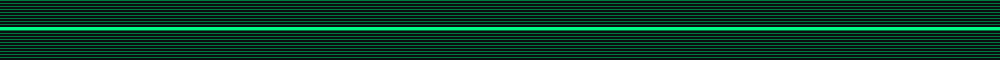

<!--
  PROFILE README for github.com/Tiltushkin
  Style: RETRO-MATRIX — neon green (#00ff88) on near-black (#0b0f10), monospaced vibe.
-->

<p align="center">
  
</p>

<p align="center">
  
</p>

<p align="center">
  
</p>

<p align="center">
  <a href="https://t.me/Tiltushkin">
    
  </a>
  <a href="https://vk.com/tiltushki_n">
    
  </a>
  <a href="https://discordapp.com/users/tiltushkin">
    
  </a>
  <a href="https://steamcommunity.com/id/tiltushkin/">
    
  </a>
  
</p>

---

### 🧬 About / О себе

```bash
$ whoami
  tiltushkin — frontend dev (React/Vue)

$ stack --matrix
  ⚙  React • Vue.js • Redux Toolkit • React Router
  🧩 Vite • Webpack • TypeScript • Node tooling
  🎯 Clean arch • predictable state • a11y • performance

$ motto
  "Ship fast. Keep it clean. Make it feel right."
```

---

### 📊 Stats & Trophies

<p align="center">
  
  
</p>

<p align="center">
  
</p>

<p align="center">
  
</p>

<p align="center">
  
</p>

---

### Codewars Rank

<p align="center">
  
</p>

---

### 💎 Избранные проекты

<table>
  <tr>
    <td width="50%" valign="top">
      <a href="https://github.com/TheLarhand/Coop_project">
        
      </a>
      <h4>🧭 Coop_project — CRM</h4>
      <p>Командный проект: CRM на React + TypeScript (авторизация, лиды, аналитика).</p>
      <p>
        <a href="https://github.com/TheLarhand/Coop_project"></a>
        
        
      </p>
    </td>
    <td width="50%" valign="top">
      <a href="https://github.com/Tiltushkin/Tiltushkin-API">
        
      </a>
      <h4>🧩 Tiltushkin-API</h4>
      <p>Backend: C# + MySQL + phpMyAdmin. REST, авторизация, CRUD.</p>
      <p>
        <a href="https://github.com/Tiltushkin/Tiltushkin-API"></a>
        
        
      </p>
    </td>
  </tr>
  <tr>
    <td width="50%" valign="top">
      <a href="https://github.com/Tiltushkin/KENTOZE-ALLAMMO">
        
      </a>
      <h4>🎯 KENTOZE-ALLAMMO</h4>
      <p>Мод для SPT: торговец всеми патронами, удобные конфиги, QoL.</p>
      <p>
        <a href="https://github.com/Tiltushkin/KENTOZE-ALLAMMO"></a>
        
        
      </p>
    </td>
    <td width="50%" valign="top">
      <a href="https://github.com/Tiltushkin/React_Guides">
        
      </a>
      <h4>📚 React_Guides</h4>
      <p>Рецепты по React: хуки, роутинг, Redux Toolkit, производительность.</p>
      <p>
        
        
      </p>
    </td>
  </tr>
</table>

---

### 📫 Contacts

- Telegram: **@Tiltushkin**
- VK: **vk.com/tiltushki_n**
- Discord: **tiltushkin**
- Steam: **steamcommunity.com/id/tiltushkin/**

<p align="center">
  <a href="https://t.me/Tiltushkin"></a>
  <a href="https://vk.com/tiltushki_n"></a>
  <a href="https://discordapp.com/users/tiltushkin"></a>
  <a href="https://steamcommunity.com/id/tiltushkin/"></a>
</p>

---

<p align="center">
  
</p>

<!--
Assets:
- Put all PNGs/GIF into ./assets next to README.
-->
