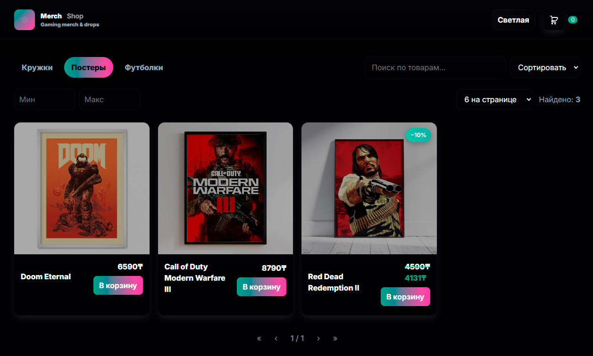

<!--
  PROFILE README
  Style: NEON-FUCHSIA — accent #FF2BD1, secondary #7A3CFF, dark bg #0A0612
-->

<p align="center">
  
</p>

<p align="center">
  
</p>

<p align="center">
  <a href="https://t.me/Tiltushkin">
    
  </a>
  <a href="https://vk.com/tiltushki_n">
    
  </a>
  <a href="https://discordapp.com/users/tiltushkin">
    
  </a>
  <a href="https://steamcommunity.com/id/tiltushkin/">
    
  </a>
  
</p>

---

### 🧬 About / О себе

```bash
$ whoami
  tiltushkin — frontend dev (React/Vue)

$ stack --neon
  ⚙  React • Vue.js • Redux Toolkit • React Router
  🧩 Vite • Webpack • TypeScript • Node tooling
  🎯 Clean arch • predictable state • a11y • performance

$ motto
  "Ship fast. Keep it clean. Make it feel right."
```

---

### 📊 Stats & Trophies

<p align="center">
  
  <!--  -->
</p>

<p align="center">
  
</p>

<p align="center">
  
</p>

<p align="center">
  
</p>

---

### Codewars Rank
<div align="center">
  <a href="https://www.codewars.com/users/Tiltushkin">
    
  </a>
</div>

---

### 💎 Избранные проекты

<table>
  <tr>
    <td width="50%" valign="top">
      <a href="https://github.com/Tiltushkin/merchShop">
        
      </a>
      <h4>Merch Shop</h4>
      <p>Онлайн-магазин игрового мерча</p>
      <p>
        <a href="https://github.com/Tiltushkin/merchShop"></a>
        
        
      </p>
    </td>
  </tr>
</table>

---

### 📫 Contacts

- Telegram: **@Tiltushkin**
- VK: **vk.com/tiltushki_n**
- Discord: **tiltushkin**
- Steam: **steamcommunity.com/id/tiltushkin/**

<p align="center">
  <a href="https://t.me/Tiltushkin"></a>
  <a href="https://vk.com/tiltushki_n"></a>
  <a href="https://discordapp.com/users/tiltushkin"></a>
  <a href="https://steamcommunity.com/id/tiltushkin/"></a>
</p>

---

<p align="center">
  
</p>

<!--
Palette:
- BG: #0A0612 (near-black plum)
- Accent: #FF2BD1 (neon fuchsia)
- Secondary: #7A3CFF (electric violet)
- Text on dark: #E6DFFF (lavender)
